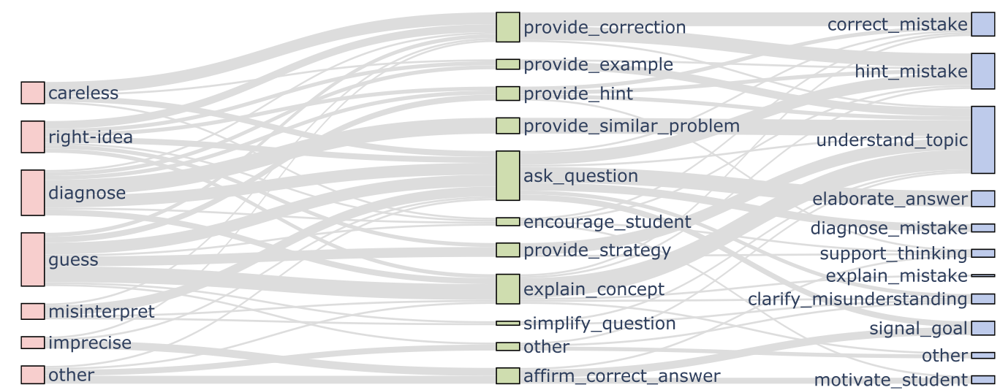
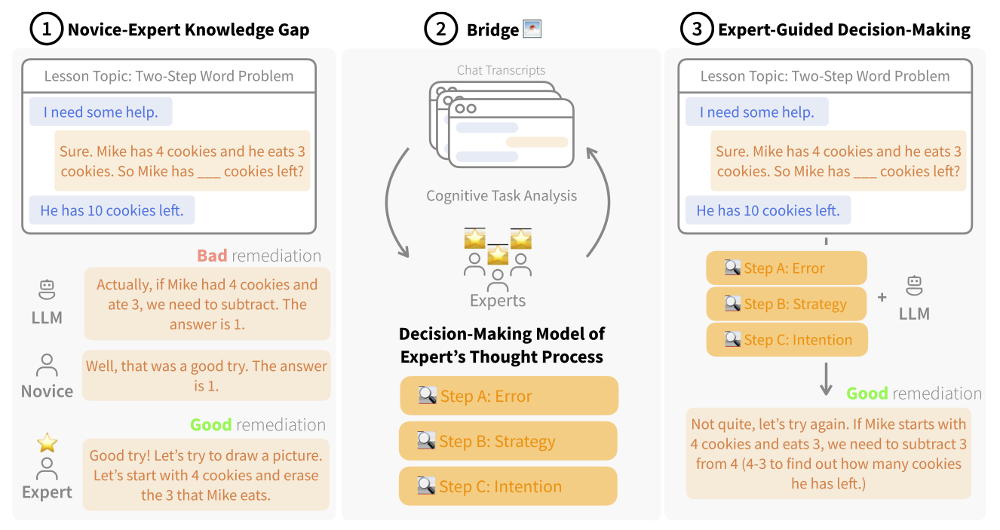
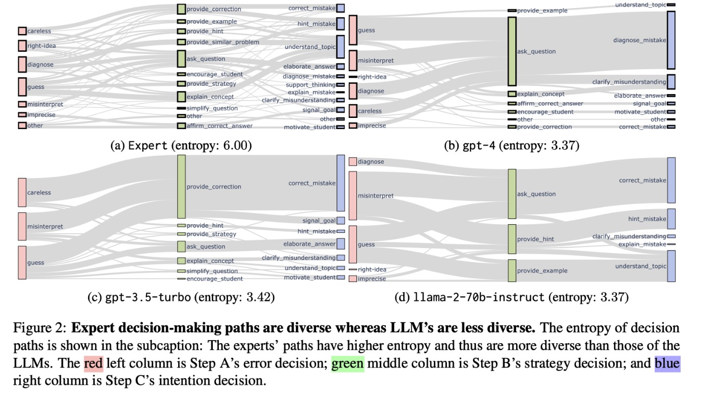
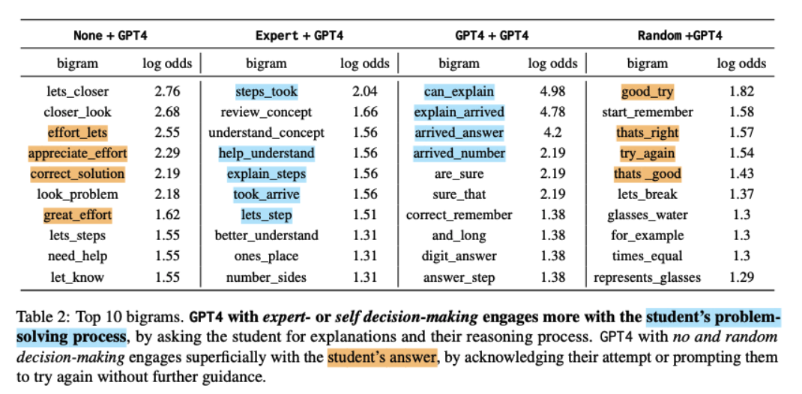

# 🌁 Bridging the Novice-Expert Gap via Models of Decision-Making

<!-- Center and enlarge the main links -->
<p align="center" style="font-size: 1.5em;">
    <a href="https://arxiv.org/abs/2310.10648">Paper</a> •
    <a href="https://huggingface.co/datasets/rose-e-wang/bridge">HuggingFace</a> •
    <a href="https://www.youtube.com/watch?v=bX5monUe93M">Video</a> •
    <a href="#citation">Citation</a>
</p>

**NAACL 2024**

**Title:** Bridging the Novice-Expert Gap via Models of Decision-Making: A Case Study on Remediating Math Mistakes

**Authors:** Rose E. Wang, Qingyang Zhang, Carly Robinson, Susanna Loeb, Dorottya Demszky

**Main Idea: We contribute Bridge 🌁, a method that uses cognitive task analysis to translate an expert's implicit thought process into an explicit decision-making model**.

*Bridge's output: Expert thought processes*


Scaling high-quality tutoring remains a major challenge in education.
Due to growing demand, many platforms employ novice tutors who, unlike experienced educators, struggle to address student mistakes and thus fail to seize prime learning opportunities.
Our work explores the potential of large language models (LLMs) to close the novice-expert knowledge gap in remediating math mistakes.
**Bridge 🌁 leverages cognitive task analysis to model an expert's internal decision-making in remediation: Experts internally identify (A) the student's error, (B) a remediation strategy, and (C) their intention before generating a response.**
We construct a dataset of 700 real tutoring conversations, annotated by experts with their decisions.
We evaluate state-of-the-art LLMs on our dataset and find that the expert's decision-making model is critical for LLMs to close the gap: 
responses from GPT4 with expert decisions (e.g., ``simplify the problem'') are +76% more preferred than without.
Additionally, context-sensitive decisions are critical to closing pedagogical gaps: 
random decisions decrease GPT4's response quality by -97% than expert decisions.
Our work shows the potential of embedding expert thought processes in LLM generations to enhance their capability to bridge novice-expert knowledge gaps. 



## 📖 Table of Contents
<p align="center">
    <a href="#dataset">Dataset</a> •
    <a href="#replication">Replication</a> •
    <a href="#citation">Citation</a>
</p>

## Dataset

The dataset is located under `dataset`.

It contains 700 tutoring conversations, each annotated with expert decisions and responses.
The structure of each item in the dataset is as follows:

```
'c_id': Conversation ID.
'lesson_topic': Lesson Topic.
'c_h': Conversation History. The last conversation turn is the student's, where they make a mistake.
'c_r': The original tutor's response to the student.
'c_r_': The expert math teacher's response.
'e': The error type identified by the expert math teacher.
'z_what': The strategy used by the expert math teacher.
'z_why': The intention used by the expert math teacher. 
```

Here's an example:
```
  {
      "c_id": "2879185_27",
      "lesson_topic": "3.4B.Rounding Whole Numbers",
      "c_h": [
          {
              "id": 27,
              "text": "Let's get started.",
              "user": "tutor"
          },
          {
              "id": 28,
              "text": "We have to round 2,458 to the nearest hundred.",
              "user": "tutor"
          },
          {
              "id": 29,
              "text": "Is that your final answer?",
              "user": "tutor"
          },
          {
              "id": 30,
              "text": "yes",
              "user": "student"
          }
      ],
      "c_r": [
          {
              "id": 31,
              "text": "That was a good try.",
              "user": "tutor"
          },
          {
              "id": 32,
              "text": "1 point for that.",
              "user": "tutor"
          },
          {
              "id": 33,
              "text": "Let me explain it to you.",
              "user": "tutor"
          }
      ],
      "c_r_": [
          {
              "user": "tutor",
              "text": "Good try! But your answer is incorrect - since we want to round to the hundred we should look at the hundreds place. Can you tell me what number is in the hundreds place?",
              "is_revised": true
          }
      ],
      "e": "diagnose",
      "z_what": "ask_question",
      "z_why": "correct_mistake",
  }
```

## Replication

### Decision-Making Paths

One interesting finding from our work is that the **human experts have extremely diverse decision-making paths** in remediating math mistakes, in contrast to the **homogeneous paths in LLMs**: 



To replicate these decision-making paths, you can run the following code:

```python

python3 scripts/generate_decision_paths.py

```

The decision paths will be saved under `results/sankey`.

### Log Odds Analysis

Another interesting finding from our work is how **better internal decision-making leads to better external responses**. In the case of remediating student mistakes, the better-ranked models engage more with the student's process, rather than just the student's answer.



To replicate the log odds analysis, you can run the following code:

```python

python3 scripts/generate_logodds_analysis.py

```

The log odds analysis will be saved under `results/logodds`.

Note: The log odds code might produce a slightly different order because some terms have the same log odds value.


## Citation

If you find our work or dataset useful, please consider citing it! 

```

@inproceedings{wang-etal-2024-bridging,
    title = {Bridging the Novice-Expert Gap via Models of Decision-Making: A Case Study on Remediating Math Mistakes},
    author = {Wang, Rose E. and Zhang, Qingyang and Robinson, Carly and Loeb, Susanna and Demszky, Dorottya},
    booktitle = "Proceedings of the 2024 Conference of the North American Chapter of the Association for Computational Linguistics",
    month = jul,
    year = "2024",
    publisher = "Association for Computational Linguistics",
}
```
